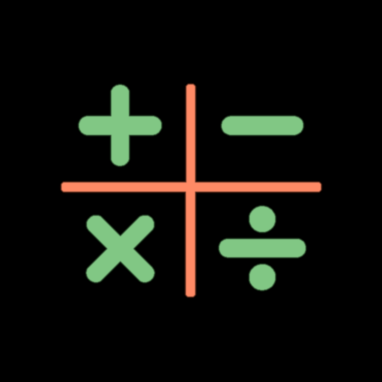
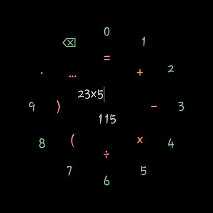
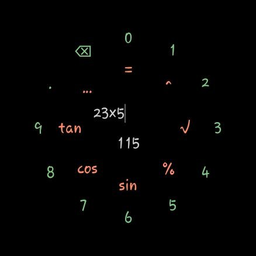

# Round Calculator for Wear OS

A sleek, intuitive calculator designed specifically for circular Wear OS displays. Built with modern Android development practices to ensure smooth performance and battery efficiency.

## 📸 Screenshots

  
  

## ✨ Features

- **Circular-Optimized UI:** Designed specifically for round Wear OS displays.
- **Smart Session Persistence:** Your work is saved automatically for 5 minutes, ensuring you never lose your progress due to system interruptions.
- **Ambient Mode Support:** Battery-efficient display that shows your latest result or formula.
- **Intuitive Gesture Control:** Navigate and calculate faster using natural watch interactions.

## 🖐 Controls & Interactions

Master your calculator with these quick gestures and interactions:

| Interaction | Action |
| :--- | :--- |
| **Swipe Left** | Delete the last character |
| **Swipe Right** | Close the application |
| **Swipe Up / "..."** | Toggle function menu |
| **Shake Device / Long Press Delete** | Full clear (Reset all) |
| **Rotate Bezel** | Move the cursor |
| **Tap Center / "="** | Apply result (transfer to input) |

### Ambient Display
When the watch enters Ambient Mode, the screen intelligently switches to a power-saving layout, displaying your current result. If no result exists, it shows the active formula.

## 🛠 Tech Stack

- **Language:** Kotlin
- **UI:** Jetpack Compose for Wear OS
- **Architecture:** MVVM, State Management
- **Persistence:** SharedPreferences (with optimized lifecycle handling)
- **Asynchrony:** Coroutines

## 🚀 Getting Started

1. Clone the repository.
2. Open in Android Studio.
3. Build and run on your Wear OS emulator or physical device.

## 📝 License

This project is licensed under the GNU General Public License v3.0 - see the [LICENSE](LICENSE) file for details.

---
*Developed with ❤️ for Wear OS.*
